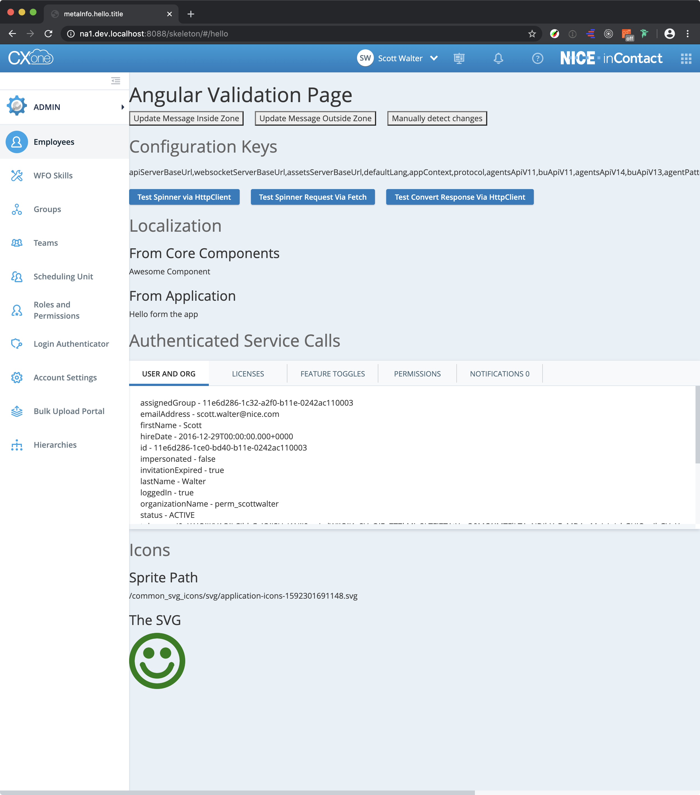

# CXone Boilerplate

FYI: This is an Angular 12 webapp. (It does not use any AngularJS code or Bower components.)

## Prerequisties
1. You have login, sso, logout, admin apps built locally
2. You have nginx configured locally to support the apps from step 1.
3. You can login to a tenant locally into the admin app

## Clone this repo
```
git clone https://github.com/nice-cxone/cxone-webapp-boilerplate.git
```

## Install npm dependencies
```
npm install
```

## Setup NGINX Location
```
    location /cxone-boilerplate/ {
        proxy_pass http://127.0.0.1:4200/;
        proxy_set_header Upgrade $http_upgrade;
        proxy_set_header Connection 'upgrade';
        proxy_set_header Host $host;
        proxy_http_version 1.1;
        proxy_cache_bypass $http_upgrade;
    }
```

## Start the app
```
npm run start
```

## Login And GO!
1. Login to your local environment [http://na1.dev.localhost:8088/](http://na1.dev.localhost:8088/)
2. Once you are logged in then enter this url [http://na1.dev.localhost:8088/cxone-boilerplate/#/hello](http://na1.dev.localhost:8088/cxone-boilerplate/#/hello)


